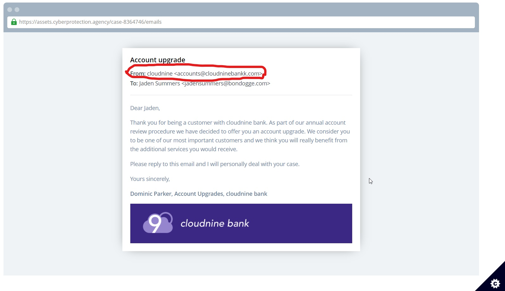

### Broken Banks
Agent, it looks like the gang are trying to raise some money to fund their plans - and they're doing so by sending fake banking emails to the customers of their bike shop to try and defraud them. Take a look at this email we intercepted, it's seemingly from a well known bank, but can you **spot anything suspicious with it**?

**Tip:** Click on the **part of the suspicious email** that makes you think it's fake and you'll get the flag.


```
Click on the marked potion
```