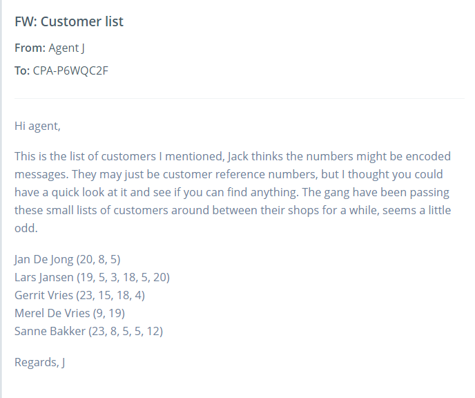

### Happy Customers
During our initial analysis of the gang we noticed something strange - they created lists of their customers and shared it between their bike shops, and each customer had a unique pattern of numbers after their name. One of our agents thinks the pattern of numbers might be **encoded words**. We also noticed the **numbers never went above 26**, that might be relevant. Can you work out what it means?

**Tip:** **Decode the message** to get the secret word and use that as the flag.



```
We may observe from the hint that 26 were all less than or equal to 26 and total number of alphabets are also 23. So, we may conclude 1=A, 2=B, 3=C,..........26=Z
```