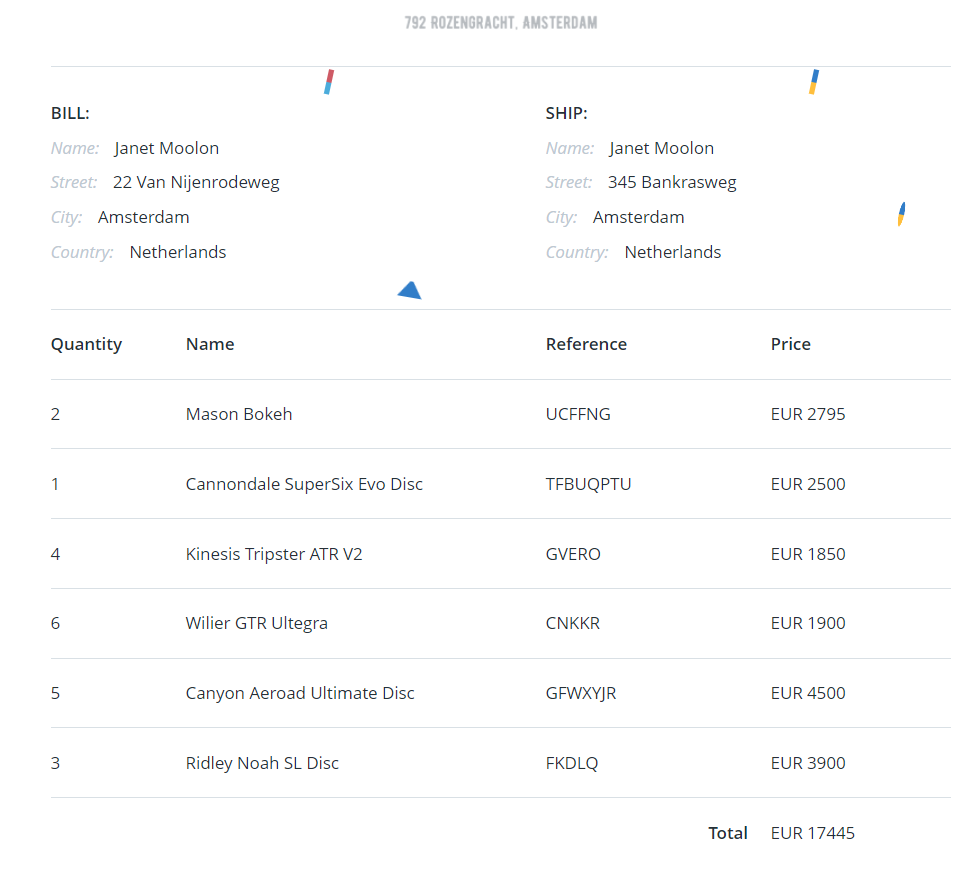

### Secret Caesar

Our agents have been reviewing some documents they recovered from one of The Slootmaekers bike shops and they came across an order form for a set of six bikes which looks a little odd.

We think the six bike reference numbers might be encrypted with a **Caesar Cipher** (which is where the letters are shifted along by a certain **offset**, e.g. if the letter is **A** and the offset is **2** it will become **C**), and we've got some intel that one of them contains a code that starts with the word "**BAR**". We've worked out that the offset for each code is determined by the **order quantity**. See if you can use that to break the encryption and find the hidden code.

**Tip:** The **decrypted reference number** containing the word **BAR** is the flag



```
When we decoded the 5th word i.e "GFWXYJR" using ceasar cipher, we received "BARSTEM" which id the flag too. 
```