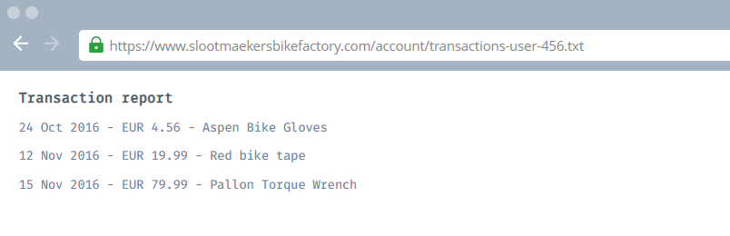

### Hidden Report

One of the ways we've been investigating the gang and their bike shop is by actually buying products from them online. We've spotted a piece of functionality that we think might be exploitable, allowing us to get more information on other customers (some of which we think might actually be helping them with their plans to steal the eBikes).

Have a look at our account page on the site, it allows you to **generate a report** of your transactions. See if you can find a way to view a transaction report for the very **first user** of the site.

**Tip:** Find the **report for the first user** of the site and you'll get the flag.

```
When we click on Generate Report button,we found the following result:
```



```
Now, observe the full url "https://www.slootmaekersbikefactory.com/account/transactions-user-456.txt" .
We can observe from the url that transation users are named as "transaction-user-{user_no}".

So in order to get transaction report of first user, we should replace the "user_no" with "1".