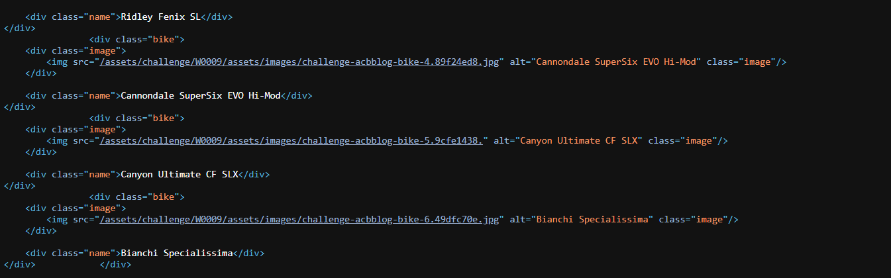

### Bike Fan

Quick task for you agent, one of the gang, Lars De Vries, has written a post where he lists pictures of bikes he likes. Recently we've noticed some of the images are broken and he hasn't fixed it. Seems odd. **Take a look** at this page and see if you can **get the image to show**, perhaps take a look at the **source code of the page** and see if anything **doesn't look right**.

**Tip:** Find a way to **get the image to show** and you'll find the flag.



```
So, from the source code, we observed that the extension of one image was missing. That's why it was broken.

We can add the extension that using "Inspect Element" and get the flag.
```