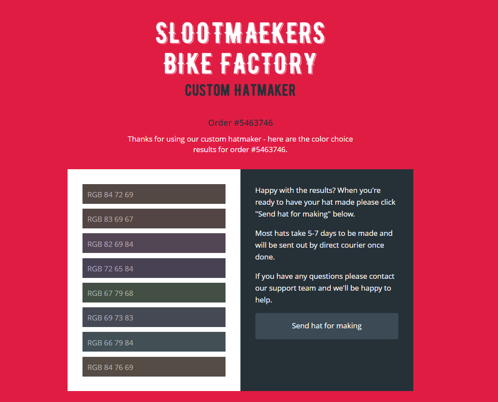

### Horrible Hats

One of our agents has noticed something a little strange that she thought you might be able to look into. The Slootmaekers have a cycle hat creator tool on their website which allows you to select a combination of up to eight colors to go into a custom hat design. The tool itself didn't seem strange until we noticed the gang were sending each other links to hat color combinations they'd created on a regular basis that were a bit dull and had no other comment. It seems a little odd and we think they might be using it to hide **secret messages**.

We've managed to get hold of an example output page which we think contains a **secret code word** the gang are using in other communications. If we could figure out that word it would really help us discover what their bigger plans are.

**Tip:** See if you can **convert** the color **RGB numbers** into **letters** using the included **ASCII table** to get the flag.



```
If we try to decode the given numbers using ASCII table, we get:
"THE SEC RET HAT COD EIS BOT TLE"

And if we rearrange the above sentence, we get:
"THE SECRET HAT CODE IS BOTTLE"

Clearly, secrest word is "BOTTLE"
```
