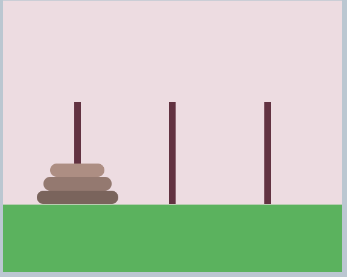

### Tower of Wheels

So, this is strange - our undercover agent noticed that one of the gang has left a set of bike wheels set up in his workshop like a **Tower of Hanoi** puzzle. We think it's wired up to his computer and might reveal something if our agent can complete the puzzle.

We've mocked up the puzzle for you to try using JavaScript. You can move the wheels by entering the following command: **move({src}, {dst})**, where the **{src}** or **{dst}** values can be **"left"**, **"mid"**, or **"right"**. For example, to move a wheel from the middle lane to the left lane you need to type: **move("mid", "left")**.  If you get stuck type **"reset"** to start again.
	
**Tip:** **Complete the puzzle** to get the flag.

	```
	move("left", "right")
	move("left", "mid")
	move("right", "mid")
	move("left", "right")
	move("mid", "left")
	move("mid", "right")
	move("left", "right")
	```
	

	