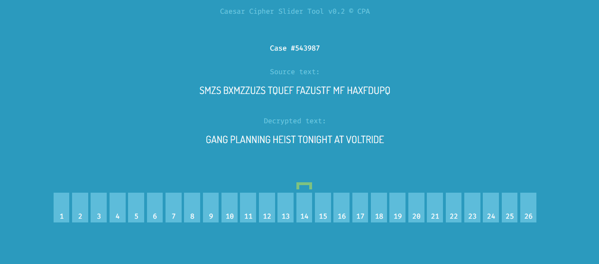

### Decryption Ring

Things are really starting to get busy - the Slootmaekers seem to be in the final stages of preparing the heist, we need to move quickly! We've just received a message back from one of our undercover agents with details of where they're planning to start their heist. It's encrypted with a **Caesar Cipher**, but we can't remember what he said he was going to use as the offset and can't seem to get hold of him again. We've put the message into our Caesar Cipher **decryption tool**, see if you can **use it** to **decrypt the text** and read the message.

**Tip:** **Decrypt the message** by dragging the green slider, the flag is the **name of the bike manufacturer**.



```
When we move the slider on 14, it decrypts the message.
The decrypted message is "GANG PLANNING HEIST TONIGHT AT VOLTRIDE"
```