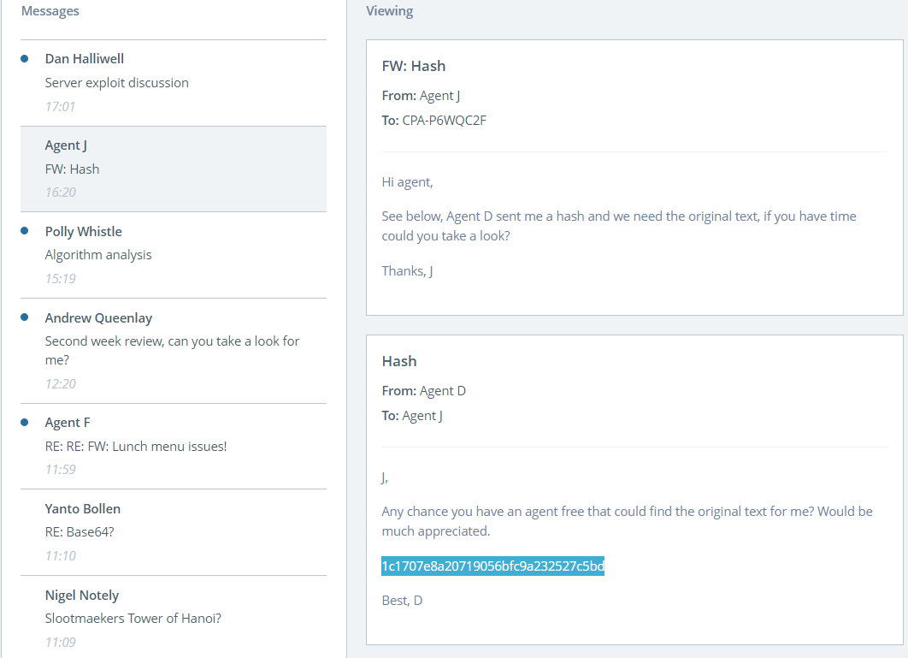

### Hard Hash

Agent D from our cryptography department has just sent me this **hash** she intercepted from an exchange between two Slootmaeker gang members. She thought it might be a good task for a smart agent like yourself to figure out.

**Tip:** Maybe someone has **already figured out** what this is a hash of. Sometimes the work of the CPA starts with an **internet search**.



```
The given hash '1c1707e8a20719056bfc9a232527c5bd' if of 'md5' type.
Decrypted text : cyclist
```


