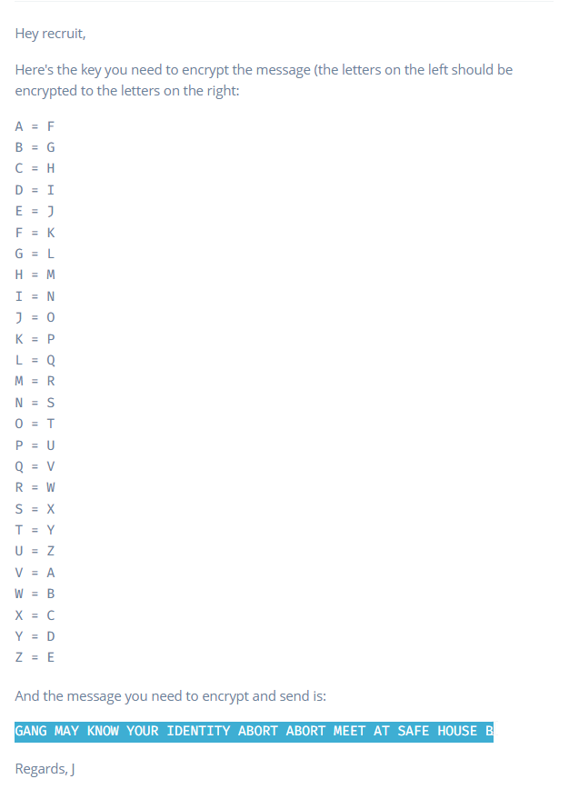

### Encrypted Message

We have an undercover agent in one of the Slootmaekers bike shops, posing as a bike mechanic. We need to send him an urgent message but the only phone he has is one the gang gave him and may be monitoring. We have a specific **Substitution Cipher** we can use - quickly **encode the message** and **send it**.

**Tip:** Correctly **encrypt the message** and **send it** to get the flag.



```
Clearly, we need to encrypt using 'ceasar cipher' using key '+5'.
Encrypted text : LFSL RFD PSTB DTZW NIJSYNYD FGTWY FGTWY RJJY FY XFKJ MTZXJ G
```