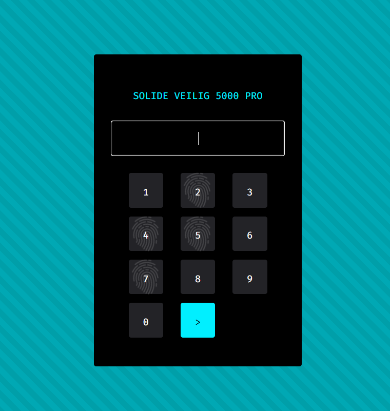

We've found a secret lock-up used by the gang, a big breakthrough! One small problem, it uses an electronic keypad and requires a **four digit pin**.

We've noticed four of the numbers have fingerprints on and we've discovered that the lock only allows you to use **each number once** (i.e. you **can't do 7777**). Can you use that information to guess the right code? There are still quite a few possible combinations so you'll need to be systematic about it.

**Tip:** **Get the right code** to get the flag.



```
Try all the combination of marked numbers.
In this case, the correct combination was '2475'
```