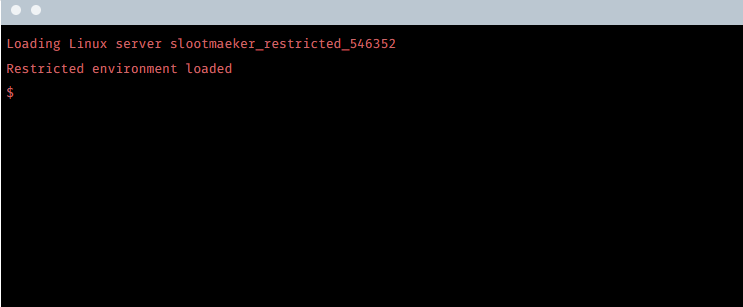

### User Who

Urgent request - one of our agents is currently at a Slootmaeker hideout and we know the rest of the gang are on their way back there. He's found a computer they've been using and managed to gain access to their **Linux server** through the use of an exploit - but we don't know **which user** he's been able to log in as, and we need to know before he runs out of time. We've patched you in to his screen - see if you can find out.

**Tip:** **Get the username**, that's the flag.


```
Use 'whoami' command
```