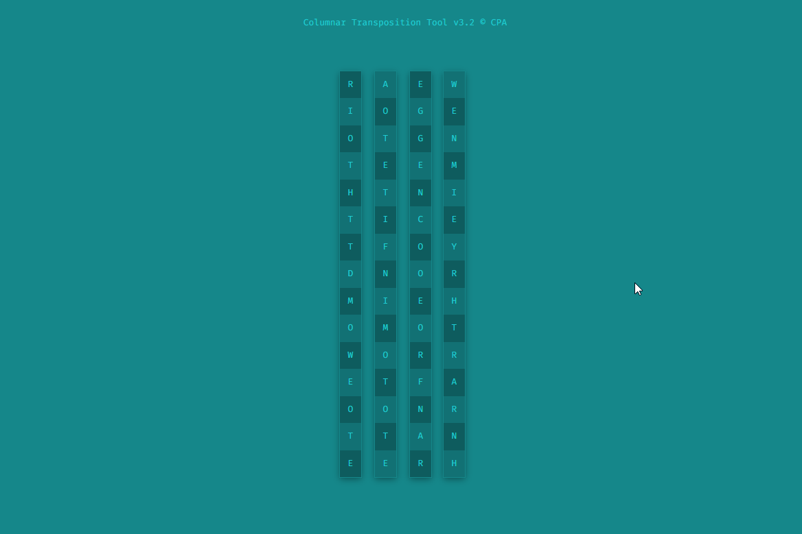
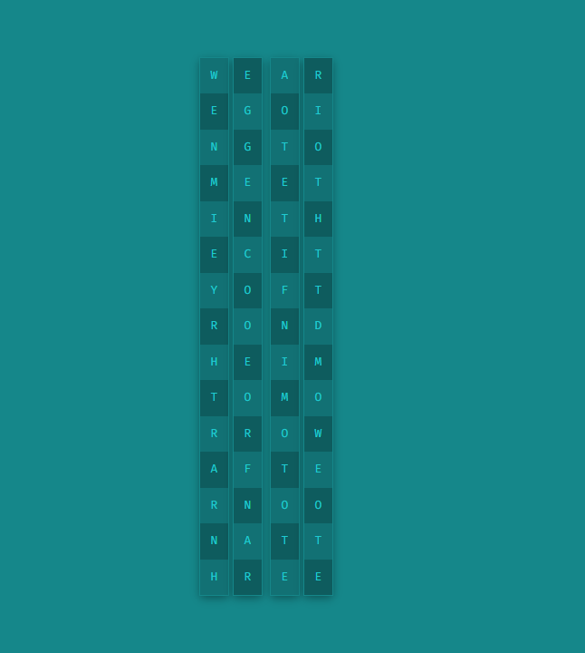

### A Secret Rendezvous

Yesterday we intercepted some code passed between two Chopper gang members - Ibert and Dante. We believe it mentions the **location of a secret meeting** to discuss plans to hack into their competitors' computers.

Fortunately, we know it uses the **Columnar Transposition Cipher** and have a CPA tool to help you crack it. We've loaded the code into the tool. Give it a try and see if you can decrypt the message.

**Tip:** The flag is the city they will be meeting in.



Let's solve the puuzzle:



```
Decrypted message : WE ARE GOING TO MEET IN THE CITY OF TRONDHEIM TOMMOROW AFTERNOON AT THREE