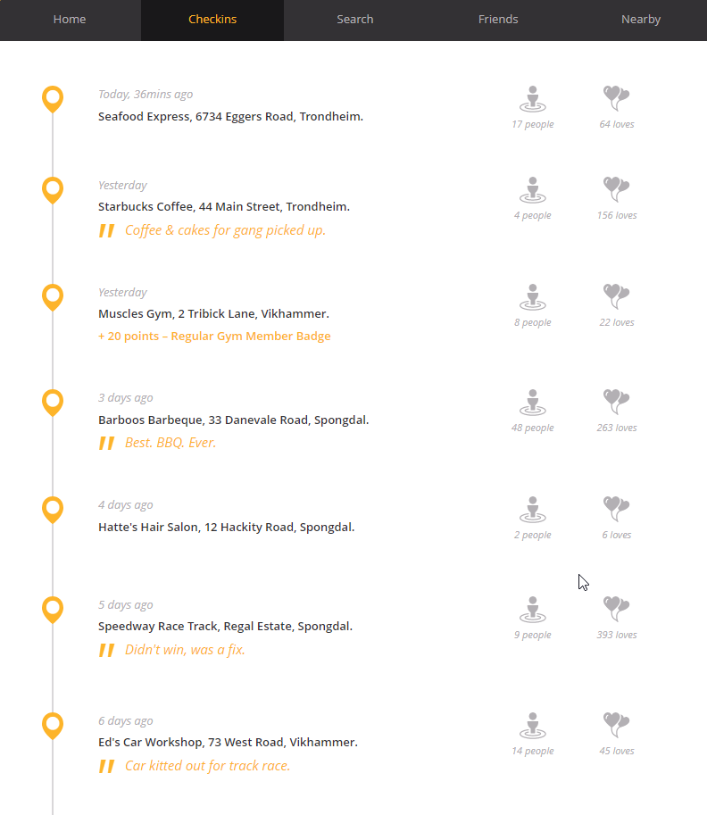

### Chopper Check-in

For this assignment we need your help keeping an eye on the gang. One of our agents wants to remotely access their computers but only when they are not around to see.

We've discovered that today is one of the gang member's **birthday party** but we don't know where it is. If we knew we could send an agent along to check they were all there.

One of the gang, Sannfred, uses a location check-in site called Circle. Perhaps you could take a look at his profile to see **where the party is**?

**Tip:** The challenge flag is the number of the building.



```
The answer is '6734' because it is the latest update and also the name of the restaurant.
```
