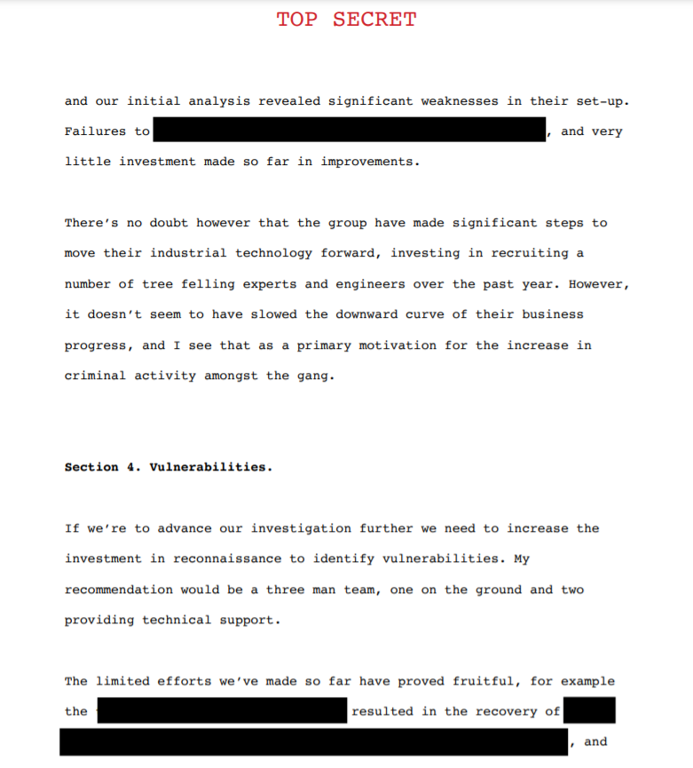

### A Helping Hand

This morning I received a message from my counterpart in another agency. It seems they've been monitoring The Choppers too.

Helpfully they've sent us over an extract from a report one of their agents wrote, which they thought might be of use to us. Unhelpfully it's a PDF and much of the sensitive information has been redacted. Maybe you could find a way to see what it says.

**Tip:** We think it contains one of the gang's passwords - that's the flag.



```
Select and copy the redacted text and paste it. You will now able to read it.

Redacted texts:
"properly lock down systems, weak password security"
"two days our agent spent on site"
"three hard drives, the password to their private server (JohnyNumber5@)"

So, the assword is : JohnyNumber5@
