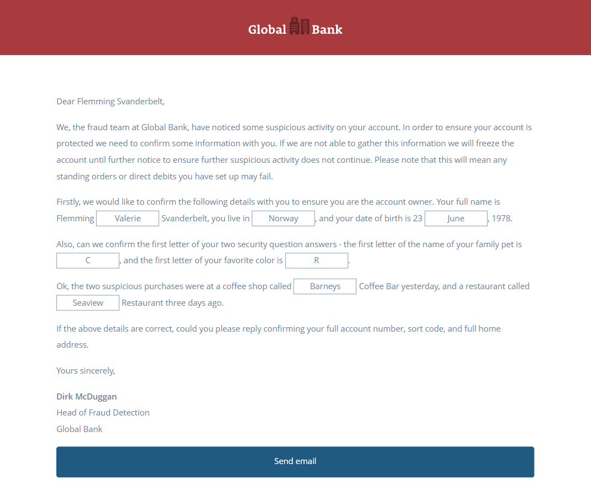

### Phishing For Flemming

In our background research on one of the gang members, Flemming, we discovered their profile page on Ansikt, a Norwegian social media site.

Luckily he's written all the details in English. We thought we might use them to create a phishing email and send it to him to try and get some further information, like his home address.

Take a look at the profile, then create the phishing email with the right details, hit "Send email", and see if he sends anything back.

**Tip:** Get all the details right, otherwise you can't send the email. When you do, you'll get the flag.

Solution:
