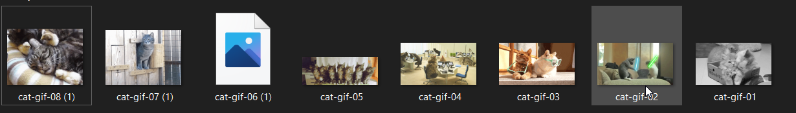
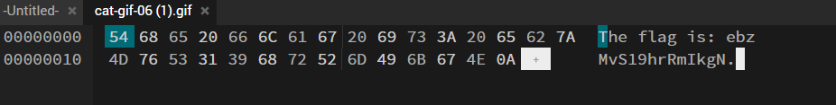

### Lost But Not Forgotten

We've recovered a bunch of .gif files from an old hard drive one of the gang members threw out. We thought they were innocent enough until we started wondering whether they were all actually GIF files.

Check your email, download the files and see if you can find out what's going on.

**Tip:** The flag is in one of the files.



```
Take a look to all gifs, 'cat-gif-06 (1)' looks odd.
```



```
Open the file in hex editor or cyberchef.
```