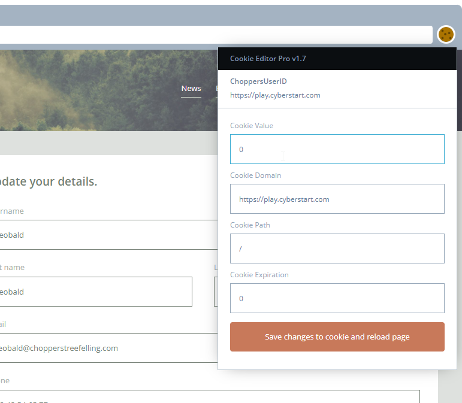

### Cookie Jar
Now that we've gained access to The Choppers' intranet site it has dawned on us that they might have more than one level of user. If we could log in as an admin user it might allow us to see much more.

Sometimes you can change the session cookie to achieve that, and admins often have an ID of 0. Why don't you give it a try?

**Tip:** Use the browser extension to help modify the cookie. If you're able to change your access to admin level the code will appear.



```
Change the cookie value to '0'
```