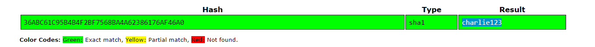

### Zapped

The gang have been using a lesser-known chat app called ChatZap to communicate. We know one of the usernames (kanako) but not the password. If we could get access we might be able to see what they're saying.

It's not a great site and the security is average at best. Look at the login page - they do SHA1 hash their passwords but leave them in plain sight in the source code. See if you can use that to get in.

**Tip:** Gain access to get the flag.

Source Code:
```
<!--

SHA1 password hash: 36ABC61C95B4B4F2BF7568BA4A62386176AF46A0

Note to self... Must make this more secure one day!

//-->
```

