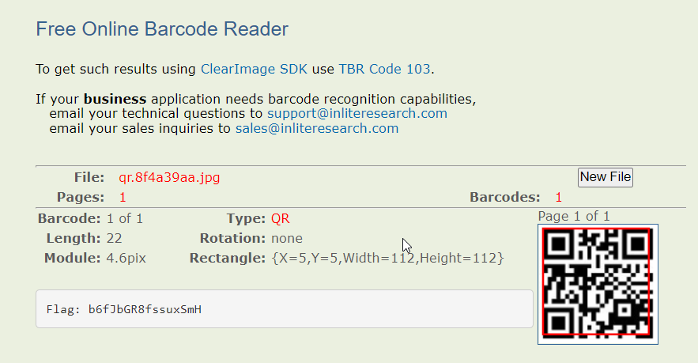

### T-Shirt Trivia

The Yakoottees have a number of side businesses that they use to launder money. One of them is an online T-shirt business. We've been monitoring the site to look for unusual activity and yesterday a T-shirt went up for sale and then ten minutes later was taken down. Luckily we've been running a tool, which takes copies of all new pages before they get removed.

There's something odd about this page. The T-shirt for sale doesn't seem to be designed like the rest (which mostly feature cars); this one has what looks like a QR code on it. Take a look and see what you think.

**Tip:** Read the code to get the flag. Not all QR code readers will show non-URL data, so you may need to try a few!



```
Try to read content of bar code using some online tool.
```