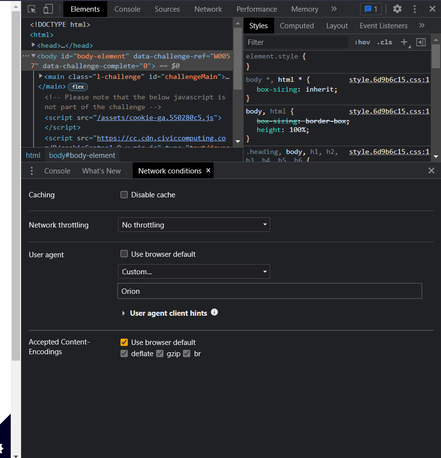

### Baffled By Browsers

Whilst monitoring the gang's web traffic, we noticed they've been visiting one particular page quite a lot. When we try we get rejected immediately without it even asking for a username or password.

Our field agent, who is working for the Yakoottees undercover, thinks it might be something to do with a particular browser that the gang built themselves called "Orion". Time for you to investigate. Try looking for a developer tool in the browser to help you out.

**Tip:** To get the flag, get access to the page!



```
Inspect Element -> Thee dots on right hand side -> more -> Network Conditions -> change user agent to custom and type 'Orion'
```