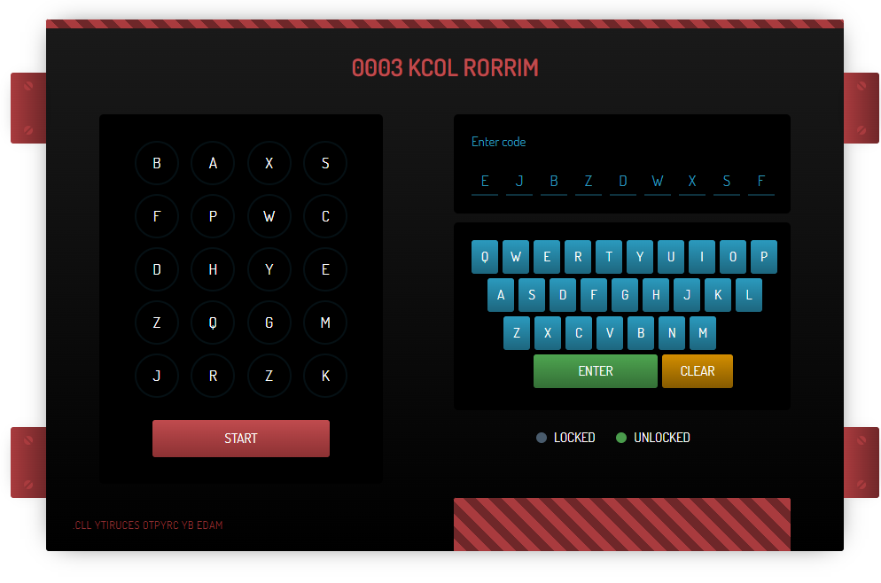

### Truck Stop

Recruit, we're sending you into the field for the first time! We think you're ready, so don't let us down.

Here's the situation. We know a group of the Yakoottees are heading to a nearby depot to steal a truck, which they are going to use to transport the supercar prototype without anyone seeing. We want to get in to the depot first and wait for them. However, we can't get hold of the depot's owners and the front gate uses a sophisticated locking system.

We know the Yakoottees have the code already, we need to crack it fast!

**Tip:** Crack the code for the flag.



```
Click on start button, it will mark some letter, note down them i.e "FSXWDZBJE", and observe that every important stuff was written in reverse order so reverse this string too. Therefore, the password would be "EJBZDWXSF".
```