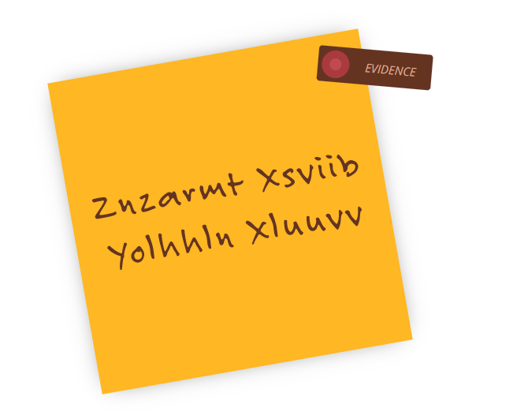

### Meeting Momoko

Our field agents decided to make a move and pick up one of the Yakoottees, Momoko. We believe she was in charge of picking up some equipment that the gang needed to break in.

Unfortunately, when they got there she'd gone. But they did find a post-it note with a cryptic code on it. On reviewing the surveillance tapes, it seems someone stuck it on her door a few minutes before she left. We think it might be a meet-up location. Can you crack the code for us?

**Tip:** Crack the code, it's the flag!



```
Encryped text:
znzarmt xsviib yolhhln xluuvv

This is encypted with "Atbash Cipher"


Decrypted text:
amazing cherry blossom coffee
```