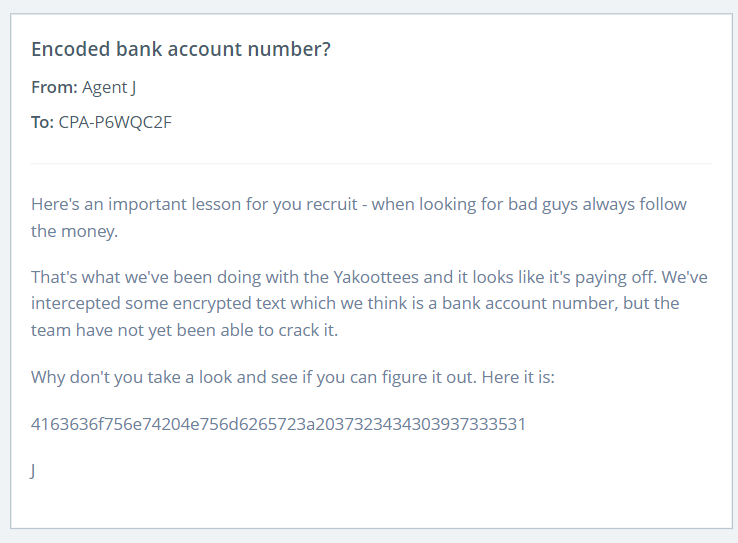

### Hush Fund

It looks like the Yakoottees are preparing for an attack and the senior members of the gang seem to be providing the funds. We've intercepted a message containing what we think are bank details, but they're encrypted. If you could decrypt them, we'd have a better idea of who is behind the plan.

**Tip:** The decrypted bank account number is the flag.



```
The given code is Hexadecimal Code.

After decoding :

  
Account Number: 7244097351
```